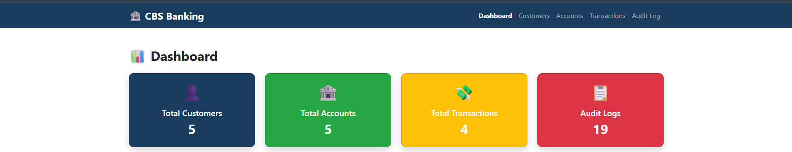
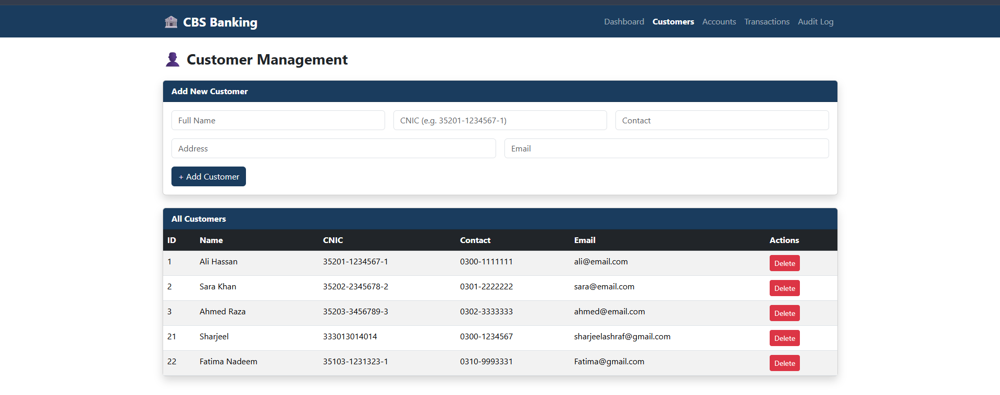
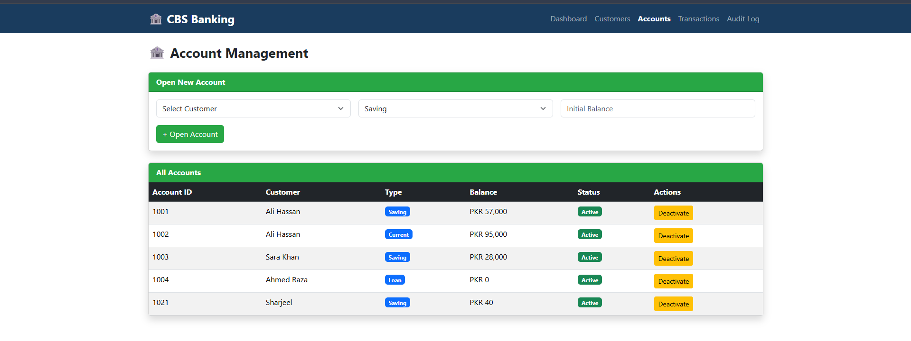
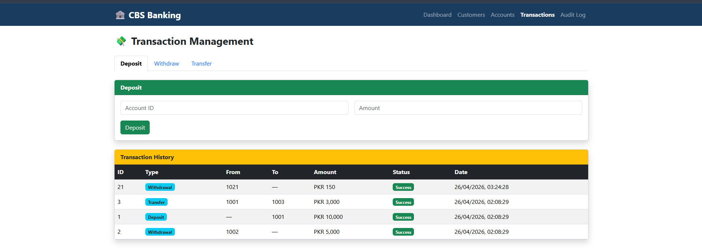
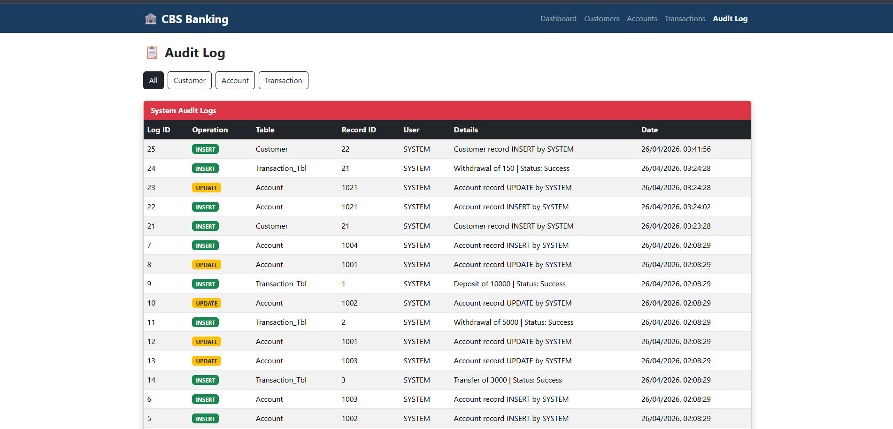

# 🏦 CBS Banking System

A full-stack **Core Banking System** built as a Final Semester Database Project at **FAST NUCES Faisalabad**.

> Designed and developed by **Fatima Nadeem (23F-0782)** and **Raja Sharjeel Ashraf (23F-0597)**

---

## 📌 Project Overview

This project simulates a simplified Core Banking System (CBS) that demonstrates how essential banking operations such as customer management, account operations, and transactions can be managed through a centralized, secure, and consistent database.

The system ensures data integrity and transaction control using Oracle's **TCL commands** (COMMIT, ROLLBACK, SAVEPOINT) embedded inside stored procedures.

---

## 🧱 Tech Stack

| Layer | Technology |
|-------|-----------|
| Database | Oracle 11g Express Edition |
| Backend | Node.js + Express.js |
| Frontend | React.js + Bootstrap 5 |
| ORM/Driver | node-oracledb (Thick Mode) |

---

## 📦 Modules

| Module | Description |
|--------|-------------|
| **Customer Management** | Add, view, and delete customer profiles |
| **Account Management** | Open accounts, update status (Active/Inactive) |
| **Transaction Management** | Deposit, Withdrawal, Transfer with TCL control |
| **Audit / Security Log** | Auto-logs every database operation via triggers |

---

## 🗄️ Database Design

### Entities
- **Customer** — CustomerID, Name, CNIC, Contact, Address, Email
- **Account** — AccountID, CustomerID (FK), Type, Balance, Status
- **Transaction_Tbl** — TransactionID, FromAccount, ToAccount, Amount, Type, Status, DateTime
- **AuditLog** — LogID, Operation, TableAffected, RecordID, ActionUser, DateTime, Details

### TCL Integration
| Scenario | Behavior |
|----------|----------|
| Deposit | UPDATE Balance → COMMIT |
| Withdrawal (insufficient funds) | Check Balance → ROLLBACK if failed |
| Transfer | SAVEPOINT → Debit → Credit → COMMIT or ROLLBACK TO SAVEPOINT |

---

## 🚀 How to Run This Project

### Prerequisites
Make sure you have the following installed:
- [Oracle 11g Express Edition](https://www.oracle.com/database/technologies/xe-prior-release-downloads.html)
- [Node.js](https://nodejs.org/) (v18 or above)
- [SQL Developer](https://www.oracle.com/tools/downloads/sqldev-downloads.html)
- [Git](https://git-scm.com/)

---

### Step 1 — Clone the Repository
```bash
git clone https://github.com/sharjeel-ashraf1/CBS_Banking_System.git
cd CBS_Banking_System
```

---

### Step 2 — Set Up the Database
1. Open **SQL Developer** and connect to your Oracle 11g instance
2. Open a new worksheet
3. Copy and run the full schema from `database/schema.sql`
4. This will create all tables, sequences, triggers, stored procedures and insert sample data
5. Press **F5** to run the entire script

---

### Step 3 — Configure the Backend
```bash
cd backend
npm install
```

Create a `.env` file inside the `backend` folder:
```env
PORT=5000
DB_USER=system
DB_PASSWORD=your_oracle_password
DB_CONNECTION=localhost:1521/XE
```
> Replace `your_oracle_password` with your actual Oracle password.

Start the backend:
```bash
node server.js
```

You should see:
```
✅ Oracle DB connected successfully
🚀 Server running on http://localhost:5000
```

---

### Step 4 — Configure the Frontend
Open a new terminal:
```bash
cd frontend
npm install
npm start
```

The app will open at **http://localhost:3000**

---

## 📁 Project Structure

```
CBS_Banking_System/
├── backend/
│   ├── config/
│   │   └── db.js
│   ├── routes/
│   │   ├── customers.js
│   │   ├── accounts.js
│   │   ├── transactions.js
│   │   └── auditlog.js
│   ├── .env          ← (not pushed to GitHub)
│   └── server.js
├── frontend/
│   ├── src/
│   │   ├── components/
│   │   │   ├── Navbar.js
│   │   │   └── Dashboard.js
│   │   ├── pages/
│   │   │   ├── Customers.js
│   │   │   ├── Accounts.js
│   │   │   ├── Transactions.js
│   │   │   └── AuditLog.js
│   │   ├── services/
│   │   │   └── api.js
│   │   └── App.js
├── database/
│   └── schema.sql
└── README.md
```

---

## 🔗 API Endpoints

### Customers
| Method | Endpoint | Description |
|--------|----------|-------------|
| GET | `/api/customers` | Get all customers |
| GET | `/api/customers/:id` | Get single customer |
| POST | `/api/customers` | Add new customer |
| DELETE | `/api/customers/:id` | Delete customer |

### Accounts
| Method | Endpoint | Description |
|--------|----------|-------------|
| GET | `/api/accounts` | Get all accounts |
| GET | `/api/accounts/customer/:id` | Get accounts by customer |
| POST | `/api/accounts` | Open new account |
| PATCH | `/api/accounts/:id/status` | Update account status |

### Transactions
| Method | Endpoint | Description |
|--------|----------|-------------|
| GET | `/api/transactions` | Get all transactions |
| GET | `/api/transactions/account/:id` | Get transactions by account |
| POST | `/api/transactions/deposit` | Deposit |
| POST | `/api/transactions/withdraw` | Withdraw |
| POST | `/api/transactions/transfer` | Transfer |

### Audit Log
| Method | Endpoint | Description |
|--------|----------|-------------|
| GET | `/api/auditlog` | Get all logs |
| GET | `/api/auditlog/table/:name` | Get logs by table |

---
## 📸 Screenshots

### Dashboard


### Customers


### Accounts


### Transactions


### Audit Log


---
## ⚠️ Important Notes

- Make sure **OracleServiceXE** and **OracleXETNSListener** Windows services are running before starting the backend
- node-oracledb runs in **Thick Mode** to support Oracle 11g — make sure Oracle Client is installed
- The `.env` file is excluded from GitHub for security — create it manually after cloning
- Oracle 11g XE has a **20 session limit** — avoid opening too many SQL Developer worksheets simultaneously

---

## 👨‍💻 Authors

| Name | Student ID |
|------|-----------|
| Fatima Nadeem | 23F-0782 |
| Raja Sharjeel Ashraf | 23F-0597 |

**FAST NUCES Faisalabad — Fall 2025**
